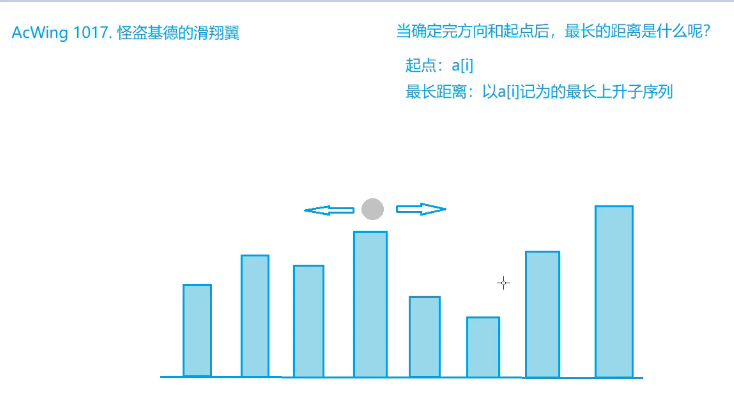
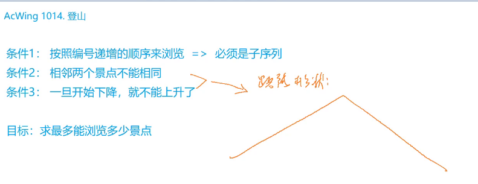
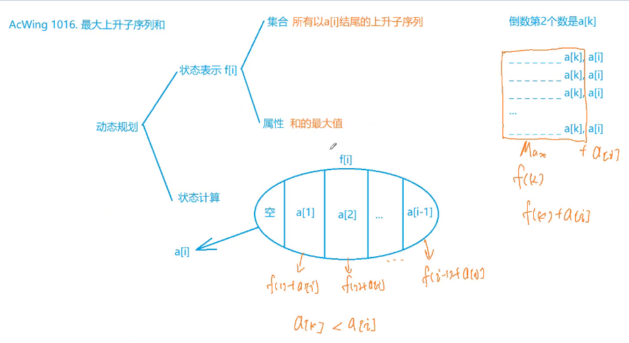
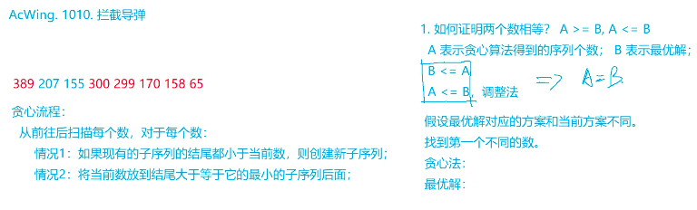
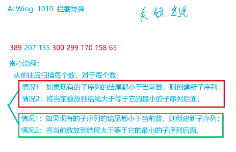
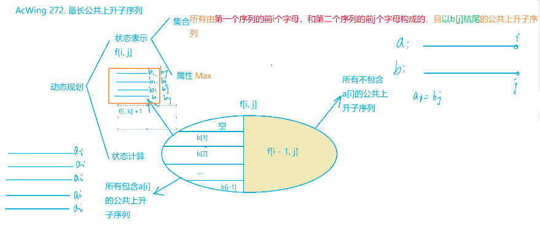
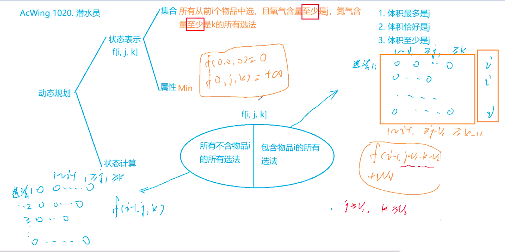
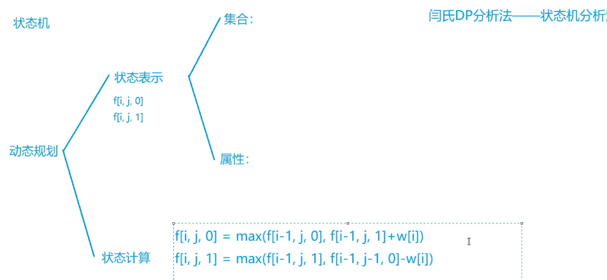

# 动态规划
## 数字三角形模型

- 摘花生
  
- 最低通行费用

- 方格取数

  

> 摘花生

```
#include<iostream>
#include<algorithm>
using namespace std;
const int N = 110;

int n, m;
int w[N][N], f[N][N];

int main()
{
		int T;
		cin>>T;
		while(T--)
		{
				cin>>n>>m;
				for(int i = 1; i <= n; i++)
						for(int j = 1; j <= m; j++)
						{
								cin>>w[i][j];
								f[i][j] = max(f[i - 1][j], f[i][j - 1]) + w[i][j];
						}
					
				cout<<f[n][m]<<endl;
		}
		return 0;
}
```


> 最低通行费用

```
/*
解法1：
time : O(N^2)
space : O(N^2)
*/

#include<iostream>
#include<algorithm>
#include<string.h>
using namespace std;

const int N = 110;

int w[N][N], f[N][N];

int main()
{
    int n;
    cin>>n;
    memset(f, 0x3f, sizeof f); //int只能设置为 0， -1， 0x3f;

    for(int i = 1; i <= n; i ++)
    {
        for(int j = 1; j <= n; j++)
        {
            scanf("%d", &w[i][j]);
        }
    }
    
    for(int i = 1; i <= n; i ++)
    {
        for(int j = 1; j <= n; j++)
        {
            if(i == 1 && j == 1)f[i][j] = w[i][j];
            else
            {
                f[i][j] = w[i][j] + min(f[i - 1][j], f[i][j - 1]);
            }
        }
    }
    cout<<f[n][n]<<endl;
    
    return 0;
}
```


> 方格取数

```
#include<iostream>
#include<algorithm>
using namespace std;

const int N = 11;
int w[N][N], f[2*N][N][N];

int main()
{
    int n;
    cin>>n;
    int x, y, z;
    while(cin>>x>>y>>z, x || y || z)
    {
        w[x][y] = z;
    }
    for(int t = 2; t <= 2 * n; t ++)
    {
        for(int i1 = 1; i1 <= n; i1 ++ )
        {
            for(int i2 = 1; i2 <= n; i2++)
            {
                int j1 = t - i1, j2 = t - i2;
                if(j1 >= 1 && j1 <= n && j2 >= 1 && j2 <= n)
                {
                    f[t][i1][i2] = max(f[t - 1][i1 - 1][i2 - 1], f[t - 1][i1][i2]);
                    f[t][i1][i2] = max(f[t][i1][i2], f[t - 1][i1][i2 - 1]);
                    f[t][i1][i2] = max(f[t][i1][i2], f[t - 1][i1 - 1][i2]);
                    f[t][i1][i2] += w[i1][j1];
                    if(i1 != i2)f[t][i1][i2] += w[i2][j2];
                }
            }
        }
    }
    cout<<f[2*n][n][n]<<endl;
    return 0;
}
```


## 最长上升子序列模型

- 怪盗基德的滑翔翼

- 登山

- 合唱队形

- 友好城市

- 最大上升子序列和

- 拦截导弹

- 导弹防御系统

- 最长公共上身子序列

  

> 怪盗基德的滑翔翼



```
#include<iostream>
#include<algorithm>
using namespace std;

const int N = 110;
int n;
int a[N], f[N], g[N];
int main()
{
		int T;
		cin>>T;
		while(T--)
		{
				cin>>n;
				for(int i = 1; i <= n; i ++)cin>>a[i];
				
				//正向求解
				int res = 0;
				for(int i = 1; i <= n; i++)
				{
						f[i] = 1;
						for(int j = 1; j < i; j++)
						{
								if(a[i] > a[j])f[i] = max(f[i], f[j] + 1);
						}
						res = max(res, f[i]);
				}
				//反向求解
				for(int i = n; i >= 1; i--)
				{
						f[i] = 1;
						for(int j = n; j > i; j--)
						{
								if(a[i] > a[j])f[i] = max(f[i], f[j] + 1);
						}
						res = max(res, f[i]);
				}
				cout<<res<<endl;
		}
}
```


> 登山



```
#include<algorithm>
#include<iostream>
using namespace std;

const int N = 1010;
int n;
int a[N], f[N], g[N];

int main()
{
    cin>>n;
    for(int i = 1; i <= n; i ++)cin>>a[i];
    for(int i = 1; i <= n; i++)
    {
        f[i] = 1;
        for(int j = 1; j < i; j++ )
        {
            if(a[i] > a[j])
                f[i] = max(f[i], f[j] + 1);
        }
    }
    for(int i = n; i >= 1; i--)
    {
        g[i] = 1;
        for(int j = n; j > i; j-- )
        {
            if(a[i] > a[j])
                g[i] = max(g[i], g[j] + 1);
        }
    }
    int res = 0;
    for(int i = 1; i <= n; i++)res = max(res, f[i] + g[i] - 1);
    cout<<res<<endl;
    return 0;
}
```


> 合唱队形

```
#include<algorithm>
#include<iostream>
using namespace std;

const int N = 110;
int n;
int a[N], f[N], g[N];

int main()
{
    cin>>n;
    for(int i = 1; i <= n; i ++)cin>>a[i];
    for(int i = 1; i <= n; i++)
    {
        f[i] = 1;
        for(int j = 1; j < i; j++ )
        {
            if(a[i] > a[j])
                f[i] = max(f[i], f[j] + 1);
        }
    }
    for(int i = n; i >= 1; i--)
    {
        g[i] = 1;
        for(int j = n; j > i; j-- )
        {
            if(a[i] > a[j])
                g[i] = max(g[i], g[j] + 1);
        }
    }
    int res = 0;
    for(int i = 1; i <= n; i++)res = max(res, f[i] + g[i] - 1);
    cout<<n - res<<endl;
    return 0;
}
```


> 友好城市

```
#include<iostream>
#include<algorithm>
using namespace std;

typedef pair<int, int>PII;

const int N = 5010;

int n;
PII a[N];
int f[N];
int main()
{
    cin>>n;
    for(int i = 0; i < n; i++)cin>>a[i].first>>a[i].second;
    sort(a, a + n);
    int res = 0;
    for(int i = 0; i < n; i++)
    {
        f[i] = 1;
        for(int j = 0; j < i; j++)
        {
            if(a[i].second > a[j].second)f[i] = max(f[i], f[j] + 1);
        }
        res = max(res, f[i]);
    }
    cout<<res<<endl;
    
    return 0;
}

```


> 最大上升子序列和



```
#include<iostream>
#include<algorithm>
using namespace std;

const int N = 1010;
int n, a[N], f[N];

int main()
{
    cin>>n;
    for(int i = 1; i <= n; i++)cin>>a[i];
    
    int res = 0;
    for(int i = 1; i <= n; i++)
    {
        f[i] = a[i];
        for(int j = 1; j < i; j++)
        {
            if(a[i] > a[j])
            {
                f[i] = max(f[i], f[j] + a[i]);
            }
        }
        res = max(res, f[i]);
    }
    cout<<res<<endl;
    return 0;
}
```


> 拦截导弹



```
#include<iostream>
#include<algorithm>
using namespace std;

const int N = 1010;

int n, q[N], f[N], g[N];

int main()
{
    while(cin>>q[n])n++;
    
    int res = 0;
    for(int i = 0; i < n; i++)
    {
        f[i] = 1;
        for(int j = 0; j < i; j++)
        {
            if(q[i] <= q[j])f[i] = max(f[i], f[j] + 1);
            res = max(res, f[i]);
        }
    }
    cout<<res<<endl;
    
    int cnt = 0;
    for(int i = 0; i < n; i++)
    {
        int k = 0;
        while(k < cnt && g[k] < q[i])k++;
        g[k] = q[i];
        if( k>= cnt)cnt ++;
    }
    cout<<cnt<<endl;
    return 0;
}
```

思考：反链定理/Dilworth定理


> 导弹防御系统



```
/*
暴力搜索
记录全局最小值
*/

```


> 最长公共上升子序列



```

```


## 背包问题

- 当空间优化成1维后，只有完全背包的体积是从小到大循环的（多重背包3不能优化到一维）

- for 物品

  ​		for 体积

  ​				for 决策

- 策略

  - 体积最多是j
    - 初始话全为0， v >= 0
  - 体积恰好是j
    - f[0] = 0, f[i] = 正负无穷， v >= 0
  - 体积至少是j 
    - f[0] = 0, f[i] = 正负无穷

> 1020 潜水员

```
#include<iostream>
#include<algorithm>
#include<string.h>

using namespace std;

const int N = 50, K = 1010, M = 160;
int n, m, k;
int f[N][M];

int main()
{
    cin>>m>>n>>k;
    memset(f, 0x3f, sizeof f);
    f[0][0] = 0;
    int res = 8e5;
    for(int i = 1; i <= k; i++)
    {
        int o2, n2, w;
        cin>>o2>>n2>>w;
        for(int j = N - 1; j >= 0; j--)
        {
            for(int k = M - 1; k >= 0; k--)
            {
                f[j][k] = min(f[j][k], f[max(0,j - o2)][max(0,k - n2)] + w);
                if(j >= m && k >= n)res = min(res, f[j][k]);
            }
        }
    }
    cout<<res<<endl;

    return 0;
}
```


> 12 背包问题求具体方案

f\[i][j] = max(f\[i - 1][j], f[i - 1, j - v[i]] + w[i])

字典序最小

- 只能选    -> 必选
- 只能不选  -> 不选
- 可选可不选  -> 必选
- 倒着考虑物品：物品N 到物品1	

```
#include<iostream>
#include<algorithm>
using namespace std;
const int N = 1010;
int v[N], w[N];
int f[N][N];

int main()
{
    int n, m;
    scanf("%d%d", &n, &m);
    for(int i = 1; i <= n; i++)cin>>v[i]>>w[i];
    
    for(int i = n; i >= 1; i--)
    {
        for(int j = 0; j <= m; j++)
        {
            f[i][j] = f[i + 1][j];
            if(j >= v[i])f[i][j] = max(f[i][j], f[i + 1][j - v[i]] + w[i]);
        }
    }
    int j = m;
    for(int i = 1; i <= n; i++)
    {
        if(j >= v[i] && f[i][j] == f[i + 1][j - v[i]] + w[i])
        {
            cout<<i<<" ";
            j -= v[i];
        }
    }
    return 0;
}
```


> 小标题

```

```


## 状态机

- 小标题

- 小标题

- 小标题

  

> 1057 股票买卖
>
> 
>
> 

```
#include<iostream>
#include<algorithm>
#include<string.h>
using namespace std;
const int N = 100010, K = 105, INF = 0x3f;
int n, k, a[N], f[N][K][2];
int main()
{
    cin>>n>>k;
    for(int i = 1; i <= n; i++)cin>>a[i];
    memset(f, -INF, sizeof f);
    f[0][0][0] = 0;
    int res = 0;
    for(int i = 1; i <= n; i++)
    {
        f[i][0][0] = 0;
        for(int j = 1; j <= k; j++)
        {
            f[i][j][0] = max(f[i - 1][j][0], f[i - 1][j][1] + a[i]);
            f[i][j][1] = max(f[i - 1][j][1], f[i - 1][j - 1][0] - a[i]);
            res = max(res, max(f[i][j][1], f[i][j][0]));
        }
    }
    cout<<res<<endl;
    return 0;
}
```


> 小标题

```

```


## 次标题

- 小标题

- 小标题

- 小标题

  

> 小标题

```

```


> 小标题

```

```


> 小标题

```

```

