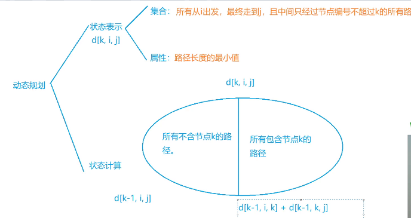

# 图论
- 单元最短路
  - 建图方式
  - 综合应用
  - 扩展应用
- Floyd算法
- 最小生成树
- 最小生成树的的扩展
- 负环


## 最短路的简单应用

- 单源最短路
  
  - 不存在负权边
    - 朴素Dijkstra算法   o(n^2)
    - 堆优化Dijkstra       o(mlogn)
  - 存在负权边
    - Bellman-Ford        o(n*m)  
      - 固定边数
    - SPFA                一般o(m), 最坏 o(n*m)  
      - 求负环     时间复杂度约等于O(n*m), trick:当所有点的入队次数大于k\*n时，就默认有负环
  
- 多源汇最短路

  - Floyd                               o(n^3)  

  

> 朴素Dijkstra算法

适合稠密图

```
#include<cstring>
#include<iostream>
#include<algorithm>
using namespace std;
const int N = 510;

int n, m;
int g[N][N];
int dist[N];
bool st[N];

int dijkstra()
{
	memset(dist, 0x3f, sizeof dist);
	dist[1] = 0;
	
	for(int i = 0; i < n; i++)
	{
		int t = -1;
		for(int j = 1; j <= n; j++)
		{
				 if(!st[j] && (t == -1 || dist[t] > dist[j]))
				 {
				 		t = j;
				 }
		}
	
		st[t] = true;
		for(int j = 1; j <= n; j++)
		{
				dist[j] = min(dist[j], dist[t] + g[t][j]);
		}
	}
	if(dist[n] == 0x3f3f3f3f)return -1;
	return dist[n];
}

int main()
{
	cin>>n>>m;
	memset(g, 0x3f, sizeof g);
	while(m --)
	{
			int a, b, c;
			cin>>a>>b>>c;
			g[a][b] = min(g[a][b], c);
	}
	int t = dijkstra();
	cout<<t<<endl;
}
```


> 堆优化Dijkstra

priority_queue 是先根据第一关键字排序，在根据第二关键字排序

```
#include<iostream>
#include<algorithm>
#include<cstring>
#include<queue>
using namespace std;
typedef pair<int, int>PII;
const int N = 100010;

int n, m;
int h[N], e[N], ne[N], w[N], idx, dist[N];
bool st[N];

void add(int a, int b, int c)
{
    e[idx] = b, w[idx] = c, ne[idx] = h[a], h[a] = idx ++ ;
}

int dijkstra()
{
    memset(dist, 0x3f, sizeof dist);
    dist[1] = 0;
    priority_queue<PII, vector<PII>, greater<PII>>heap;
    heap.push({0, 1});
    while(heap.size())
    {
        PII t = heap.top();
        heap.pop();
        int ver = t.second, distance = t.first;
        
        if(st[ver])continue;
        st[ver] = true;
        
        for(int i = h[ver]; i != -1; i = ne[i])
        {
            int node = e[i];
            if(dist[node] > distance + w[i])
            {
                dist[node] = distance + w[i];
                heap.push({dist[node], node});
            }
        }
    }
    
    if(dist[n] == 0x3f3f3f3f)return -1;
    else return dist[n];
}
int main()
{
    cin>>n>>m;
    memset(h, -1, sizeof h);
    for(int i = 0; i < m; i++)
    {
        int a, b, c;
        cin>>a>>b>>c;
        add(a, b, c);
    }
    int t = dijkstra();
    cout<<t<<endl;
}
```


> Bellman-Ford

```
#include<cstring>
#include<iostream>
#include<algorithm>
using namespace std;
const int N = 510, M = 10010;
struct Edge
{
    int a, b, c;
}edges[M];

int n, m, k; 
int dist[N];
int backup[N];

void bellman_ford()
{
    memset(dist, 0x3f, sizeof dist);
    dist[1] = 0;
    for(int i = 0; i < k; i++)             //最多经过K条边
    {
        memcpy(backup, dist, sizeof dist); //防止发生串联
        for(int j = 0; j < m; j++)
        {
            auto e = edges[j];
            int a = e.a, b = e.b, c = e.c;
            dist[b] = min(dist[b], backup[a] + c);
        }
    }
}

int main()
{
    cin>>n>>m>>k;
    for(int i = 0; i < m; i++)
    {
        int a, b, c;
        cin>>a>>b>>c;
        edges[i] = {a, b, c};
    }
    bellman_ford();
    if(dist[n] > 0x3f3f3f3f / 2)cout<<"impossible"<<endl;
    else cout<<dist[n]<<endl;
    return 0;
}
```


> SPFA 

```
#include<cstring>
#include<iostream>
#include<algorithm>
#include<queue>

using namespace std;
const int N = 100010;

int n, m;
int h[N], w[N], e[N], ne[N], idx;
int dist[N]; //离源点的最短距离
bool st[N];  //是否在循环队列中
void add(int a, int b, int c)
{
    e[idx] = b, w[idx] = c, ne[idx] = h[a], h[a] = idx ++;
}

int spfa()
{
    memset(dist, 0x3f, sizeof dist);
    dist[1] = 0;
    
    queue<int>q;
    q.push(1);
    st[1] = true;
    
    while(q.size())
    {
        int t = q.front();
        q.pop();
        st[t] = false;
        
        for(int i = h[t]; i != -1; i = ne[i])
        {
            int j = e[i];
            if(dist[j] > dist[t] + w[i])
            {
                dist[j] = dist[t] + w[i];
                if(!st[j])
                {
                    q.push(j);
                    st[j] = true;
                }
            }
        }
    }
    return dist[n];
}

int main()
{
    cin>>n>>m;
    memset(h, -1, sizeof h);
    while(m --)
    {
        int a, b, c;
        cin>>a>>b>>c;
        add(a, b, c);
    }
    int t = spfa();
    if(t == 0x3f3f3f3f)cout<<"impossible"<<endl;
    else cout<<t<<endl;
    return 0;
}
```


> Floyd

```
#include<iostream>
#include<cstring>
#include<queue>
#include<algorithm>
using namespace std;
const int N = 110, M = 410;
int n, m, g[N][N];

int main()
{
    cin>>n>>m;
    memset(g, 0x3f, sizeof g);
    while(m --)
    {
        int a, b, c;
        cin>>a>>b>>c;
        g[a][b] = g[b][a] = min(g[a][b], c);
    }
    //无需将源点距离设为0
    for(int k = 1; k <= n; k++)
        for(int i = 1; i <= n; i++)
            for(int j = 1; j <= n; j++)
                g[i][j] = min(g[i][j], g[i][k] + g[k][j]);
    int res = 0;
    for(int i = 1; i <= n; i++)
        if(g[1][i] == 0x3f3f3f3f)
        {
            res = -1;
            break;
        }
        else
        {
            res = max(res, g[1][i]);
        }
    cout<<res<<endl;
    return 0;
}
```

## 最短路的综合应用

- DFS
- 二分
- DP
- 拓扑排序

> 小标题

```

```


## 最短路的扩展应用

- 小标题

  

> 小标题

```

```


## SPFA:负环与差分约束

- SPFA求负环

  - 统计每个点入队的次数，如果某个点入队N次，则说明存在负环
    - bellman-ford
  - 统计当前每个点的最短路中所包含的边数，如果某点的最短路所包含的边数大于等于N，则说明有负环
    - spfa 

- 差分约束

  - 求不等式组的可行解
    - 从**源点**出发，可以遍历**所有边**
      1. 先将不等式xi <= xj + ck 转化成一条边（xi 到 xj, 权值ck）
      2. 找一个超级源点，可以遍历所有**边**
      3. 求单源最短路径
         - 如果存在负环，则原不等式组一定无解
         - 如果无负环，则dist[i]就是原不等式组的一个可行解
  - 求最大值或最小值
    - 如果求的是最小值，则答案为最长路
    - 如果求的是最大值，则答案为最短路

- 小标题

  

> 小标题

```

```


## floyd 多源多汇最短路
- 不可包含负环
- 最短路
- 传递闭包
- 找最小环（正数）
- 恰好经过K条边的最短路（倍增）
- 做法：

初始化：d\[i][j] = 正无穷， d\[i][i] = 0

for(k : 1 ~ n)

​	for(i : 1 ~ n)

​		for(j : 1 ~ n)

​			d\[i][j] = min(d\[i][j], d\[i][k] + d\[k][j])



>最短路
```

```

>传递闭包


```

```

>找最小环（正数）
```

```

>恰好经过K条边的最短路（倍增）
```

```

## 最小生成树

- 无向边，边权为正，树，

- 任意一棵最小生成树一定可以包含无向图中权值最小的边

- 推论：看书

- Prim

  - 朴素版本            O(N^2), 邻接矩阵
  - 堆优化版本
  - 从当前连通块与外界连接的边中最小的边

- Kruskal

  - 更常用
  - 基于并查集，先将边排序，如果边的两点不连通，则加入结果集
  - O(MlogM)     直接存边，稀疏图
  
- 次小生成树

  - 定义：给一个带权图，把图的所有生成树按照权值从小到大排序，第二小的称为次小生成树
  - 方法1：先求最小生成树，在枚举删去最小生成树的边求解， 时间O(MlogM + NM)
  - 方法2：先求最小生成树， 在枚举非树边，然后将该边加入树种，同时从树中去掉一条边，使得最终的图还是一棵树，时间(MlogM + M + N^2)
  
  

> Prim

```
#include<cstring>
#include<iostream>
#include<algorithm>
using namespace std;
const int N = 110;
int g[N][N], dist[N];
bool st[N];
int n;
int prim()
{
    memset(dist, 0x3f, sizeof dist);
    dist[0] = 0;
    int res = 0;
    for(int i = 0; i < n; i++)
    {
        int t = -1;
        for(int j = 0; j < n; j++)
        {
            if(!st[j] && (t == -1 || dist[j] < dist[t]))
                t = j;
        }
        res += dist[t];
        st[t] = true;
        for(int j = 0; j < n; j++)dist[j] = min(dist[j], g[t][j]);
    }
    return res;
}
int main()
{
    cin>>n;
    for(int i = 0; i < n; i++)
        for(int j = 0; j < n; j ++)
            cin>>g[i][j];
    cout<<prim()<<endl;
}
```


> Kruskal

```

```


## 最近公共祖先

- 向上标记法 O(N) 暴力解法，不常用
- 倍增法

  - 预处理     O(N*logN)
  - fa[i, j]表示从 i 开始，向上走 2^j 步所能走到的节点：0 <= j <= logN ； depth[i]表示深度
  
  				- 步骤        O(logN)
  				- 先将两个点调到同一层
  		- 让两个点同时往上跳，一直跳到他们的**最近公共祖先的下一层**	
- Tarjan - 离线求lca  O(N + M)
  - 在深度优先遍历时，将点分成三类：1. 已经遍历且回溯；2.正在搜索的分支；3.还未搜索到的点

> 小标题

```

```

## 有向图的 强连通分量SCC

- 对于有向图，**连通分量**：对于分量中任意两点u, v, 必然可以从u走到v, 且从v走到u。
- **强连通分量**：极大连通分量
- 将**有向图**通过**缩点**的方式转换为**有向无环图DAG**
  - 树枝边，前向边，后向边，横叉边
  - 情况1：存在后向边指向祖先节点
  - 情况2：存在横叉边，横叉边可以走到祖先节点
> Tarjan算法求SCC

对于每个点定义两个时间戳：dfn[u]表示遍历到u的时间戳；low[u]从u开始走，所能遍历到的最小时间戳。

u是其所在强连通分量的最高点，等价于dfn[u] = low[u]

```
# tarjan求强连通分量
void tarjan(int u)
{
	dfn[u] = low[u] = ++ timestamp;
	stk[++ top] = u, in_stk[u] = true;
	
	for(int i = h[u]; i != -1; i = ne[i])
	{
			int j = e[i];
			if(!dfn[j])
			{
					tarjan(j)
					low[u] = min(low[u], low[j]);
			}
			else if(in_stk[j])
			{
					low[u] = min(low[u], dfn[j]);
			}
	}
	
	if(dfn[u] == low[u])
	{
			int y;
			++ scc_cnt;
			do{
					y = stk[top --];
					in_stk[y] = false;
					id[y] = scc_cnt;
			}while(y != u);
	}
}
```
```
# 缩点，连通分量递减的顺序就是拓扑序

```

```

```
> 小标题

```

```

## 无向图的 双连通分量

- 边双连通分量 e-dcc
  - 桥 dfn[x] < low[y]
  - **极大**的不包含桥的连通分量
  - 找连通分量
    - 删除所有桥，剩下的所有连通块就是边连通分量
    - stack  dfn[x] = low[x]
- 点双连通分量 v-dcc
  - 割点 low[y] >= dfn[x]
    - 如果x不是根节点，那么x是割点
    - 如果x是根节点，至少x有2个子节点y2, low[y2] >= dfn[x], 那么x是割点
  - **极大**的不包含割点的连通块
  - 找连通分量
    - 

不存在横叉边；

割点与桥之间无直接关系，具体情况具体分析；

同理，边连通分量与点连通分量无直接关系。

> 小标题

```

```
> 小标题

```

```

## 二分图

- 不存在奇数环
- 染色法不存在矛盾
-  
> 小标题

```

```
> 小标题

```

```
## 匈牙利算法

- 匹配
- 最大匹配
- 匹配点
- 增广路径
> 小标题

```

```
> 小标题

```

```
## 覆盖

- 最小点覆盖
- 最大独立集
- 最小路径覆盖
- 最小路径点覆盖
- 最大匹配数 = 最小点覆盖 = 总点数 - 最大独立集 = 总点数 - 最小路径覆盖
> 小标题

```

```
> 小标题

```

```
## 匹配

- 最优匹配KM
- 多重匹配
> 小标题

```

```
> 小标题

```

```

## 欧拉回路

- 小标题
- 小标题
> 小标题

```

```
> 小标题

```

```


## 拓扑排序与关键路径

- 小标题
- 小标题
> 小标题

```

```
> 小标题

```

```


