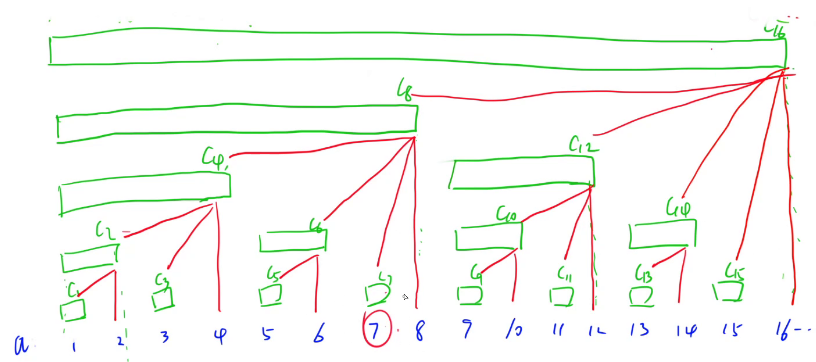

# 高级数据结构
## 并查集

- 合并两个集合
  
- 查询某个元素的祖宗节点

- 路径压缩   O(log N)

- 按轶合并  O(log N)

- 记录每个集合大小                    -> 绑定到根节点

- 记录每个点到根节点的距离     ->绑定到每个元素

  

> 离散化

- 保序
  - 排序，判重，二分
- 不包序
  - map
  - hash

```

```


> 小标题

```

```


> 小标题

```

```


## 树状数组

- 基本原理
- 扩展
  - 树状数组 + 差分
  - 树状数组 + 差分 + 公式
- 例题
- 用处
- 快速求前缀和  O(logN)
  - for(int i = x; i; i -= lowbit(i))res += tr[i];
- 修改某个数      O(logN)
  - for(int i = x; i <= n; i += lowbit(i))tr[i] += c;



> 初始化

```
/* O(NlogN) */
for(int i = 1; i <= n; i++)add(i, a[i]);

/* O(N) */
for(int i = 1; i <= n; i++)s[i] = s[i - 1] + a[i];
for(int i = 1; i <= n; i++)tr[i] = s[i] - s[i - lowbit(i)]
```


> 树状数组 + 差分 

a[L ~ R] += c

求a[x] = b[1] + b[2] + ... + b[x]

```

```


> 小标题

```

```


## 线段树

- 小标题

- 小标题

- 小标题

  

> 小标题

```

```


> 小标题

```

```


> 小标题

```

```


## 平衡树、Treap

- 小标题

- 小标题

- 小标题

  

> 小标题

```

```


> 小标题

```

```


> 小标题

```

```


## AC自动机

- 小标题

- 小标题

- 小标题

  

> 小标题

```

```


> 小标题

```

```


> 小标题

```

```


## 可持久化数据结构

- 小标题

- 小标题

- 小标题

  

> 小标题

```

```


> 小标题

```

```


> 小标题

```

```

